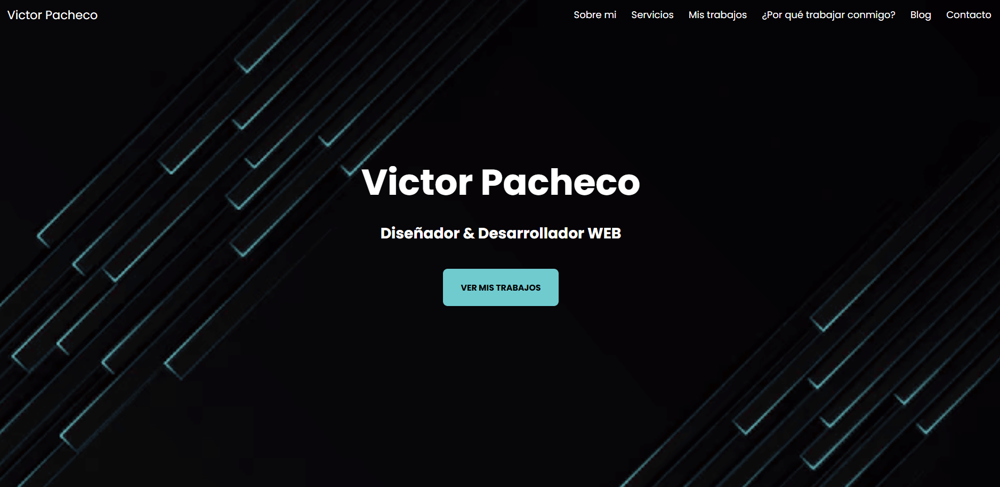

🧑‍💻 WEB VP — Página Personal / Portfolio

---

👤 Autor

**Víctor Pacheco Martín (VPWEB)**  
📍 Granada, España  
🎓 Estudiante de DAM – Instituto Tecnológico Poniente  
💻 Apasionado por el desarrollo de software, Python, bases de datos, Odoo y proyectos de VR con Unreal Engine.  
🔗 GitHub: https://github.com/VPWEB  

📖 Descripción

WEB_VP es una página web personal desarrollada como práctica del módulo Lenguaje de Marcas en el ciclo DAM.
Su objetivo es presentar una web simple, funcional y estructurada, donde se integran elementos como:

- Presentación personal
- Secciones informativas
- Navegación limpia
- Estilos personalizados
Este proyecto sirve como base para futuros portfolios más completos.

🚀 Demo Online

🔗 [Ver la página en vivo](https://vpweb.github.io/WEB_VP/)

🎨 Vista previa

🛠️ Tecnologías utilizadas

- HTML5 – estructura principal
- CSS3 – estilos personalizados
(Futuro: agregar interacción rápida con JavaScript)
